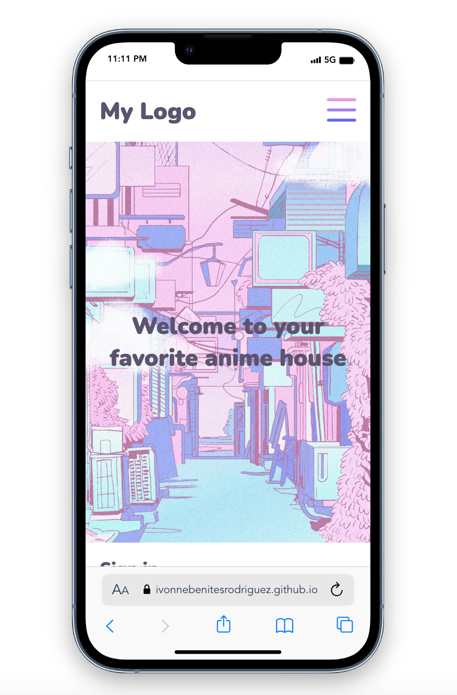
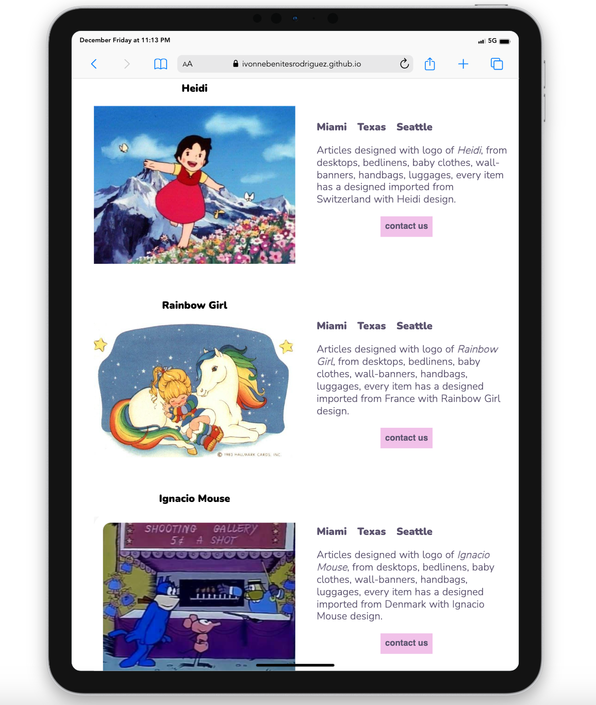

# favorite_cartoons_site 🌷


{width=200 height=200}
{width=200 height=200}
{width=200 height=200}

# 📗 Table of Contents

- [favorite\_cartoons\_site 🌷](#favorite_cartoons_site-)
- [📗 Table of Contents](#-table-of-contents)
- [\[favorite\_cartoons\_site\] ](#favorite_cartoons_site--1)
  - [🛠 Built With ](#-built-with-)
    - [Tech Stack ](#tech-stack-)
    - [🌸🌷 Key Features ](#-key-features-)
  - [💻 Getting Started ](#-getting-started-)
    - [🌷Prerequisites](#prerequisites)
    - [🌷Setup](#setup)
  - [🌷 Author ](#-author-)
  - [🔭🌷 Future Features ](#-future-features-)
  - [🤝 Contributing ](#-contributing-)
  - [⭐️ Show your support ](#️-show-your-support-)
  - [🙏 Acknowledgments ](#-acknowledgments-)
  - [📝 License ](#-license-)

<!-- PROJECT DESCRIPTION -->

# [favorite_cartoons_site] <a name="about-project"></a>
*Favorite cartoons site* is a single page built in HTML and CSS. 
It is a friendly responsive site.
<br/>

🚀 Please visit my site:<br/>
[Link]: https://ivonnebenitesrodriguez.github.io/favorite_cartoons_site/
<br/>


## 🛠 Built With <a name="built-with"></a>

### Tech Stack <a name="tech-stack"></a>

<details>
<summary>HTML🌷</summary>
  <ul>
    <li><a href="https://developer.mozilla.org/es/docs/Web/HTML">HTML🌷</a></li>
  </ul>
</details>

<details>
<summary>CSS🌷</summary>
  <ul>
    <li><a href="https://developer.mozilla.org/es/docs/Web/CSS">CSS🌷</a></li>
  </ul>
</details>


### 🌸🌷 Key Features <a name="key-features"></a>

- **[Built a site using HTML]**
- **[Style the site using CSS]**
- **[Responsive Design]**
- **[Set-up Linters]**
- **[Add Fonts folder]**
- **[Respected Gitflow]**

<p align="right">(<a href="#readme-top">back to top</a>)</p>

## 💻 Getting Started <a name="getting-started"></a>

To get a local copy up and running, follow these steps.

### 🌷Prerequisites

In order to build this project you need:

```sh
 install visual code
```

### 🌷Setup

Clone this repository to your desired folder:


```sh
  cd my-folder
  git clone git@github.com/IvonneBenitesRodriguez/favorite_cartoons_site.git
```

<p align="right">(<a href="#readme-top">back to top</a>)</p>

## 🌷 Author <a name="authors"></a>

🌸**Author** Ivonne Benites Rodriguez <br/>

- 🌷GitHub: [@githubhandle](https://github.com/IvonneBenitesRodriguez)
- 🌷Twitter: [@twitterhandle](https://twitter.com/IvonneBenitesR)
- 🌷LinkedIn: [LinkedIn](https://www.linkedin.com/in/ivonnebenites/)

<p align="right">(<a href="#readme-top">back to top</a>)</p>

## 🔭🌷 Future Features <a name="future-features"></a>

- [ ] **[Add new functionalities using JavaScript]**

<p align="right">(<a href="#readme-top">back to top</a>)</p>

## 🤝 Contributing <a name="contributing"></a>

Contributions, issues, and feature requests are welcome!

Feel free to check the [issues page](../../issues/).

<p align="right">(<a href="#readme-top">back to top</a>)</p>

## ⭐️ Show your support <a name="support"></a>

If you like this project, give it a start ⭐️ and a nice comment.

<p align="right">(<a href="#readme-top">back to top</a>)</p>

## 🙏 Acknowledgments <a name="acknowledgements"></a>

I would like to thank Microverse for providing us with resources and 
knowledge necessary to carry out this project.

<p align="right">(<a href="#readme-top">back to top</a>)</p>

## 📝 License <a name="license"></a>

This project is [MIT](./LICENSE) licensed.

<p align="right">(<a href="#readme-top">back to top</a>)</p>
